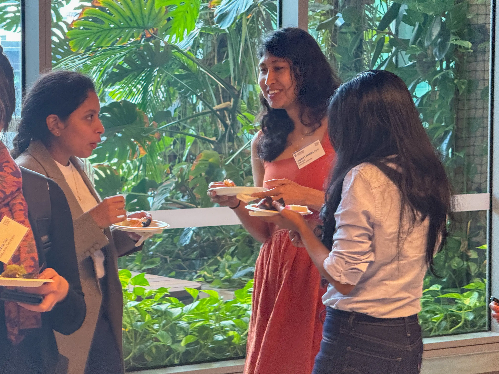
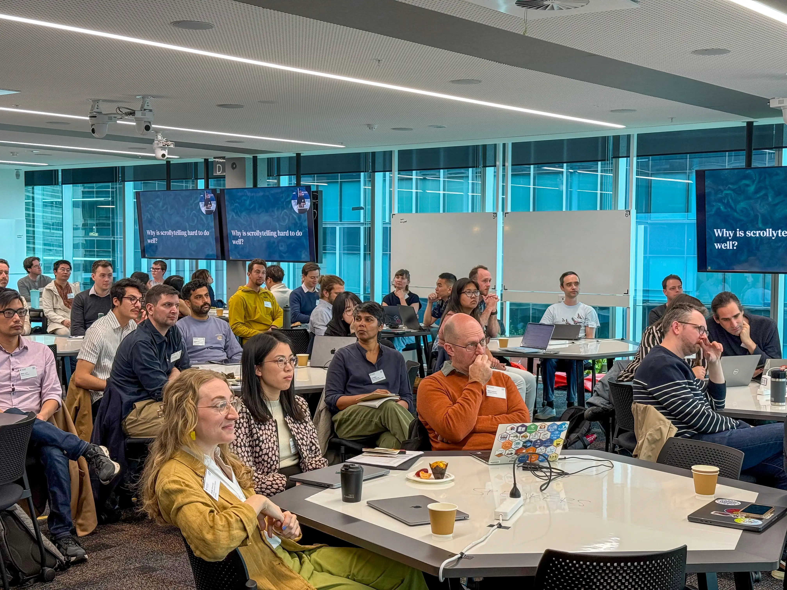
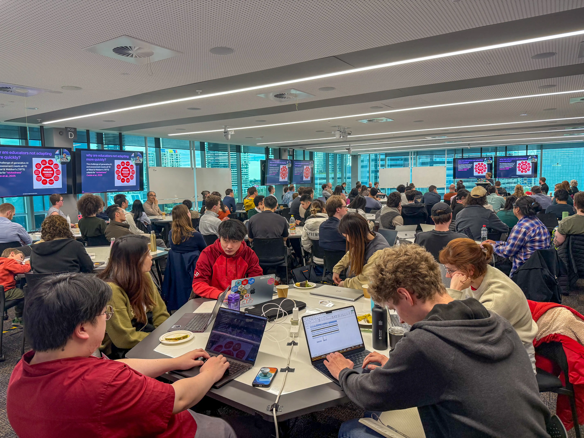
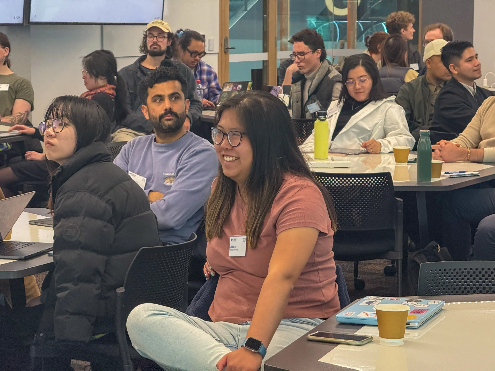
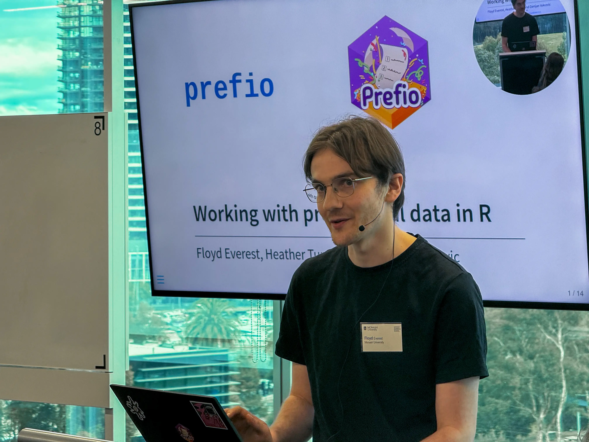
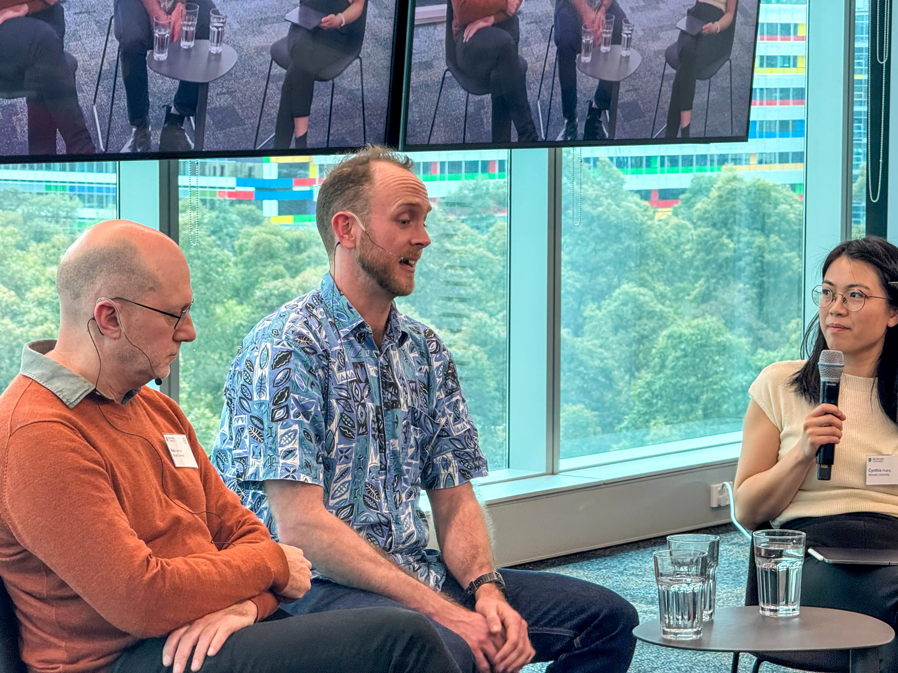
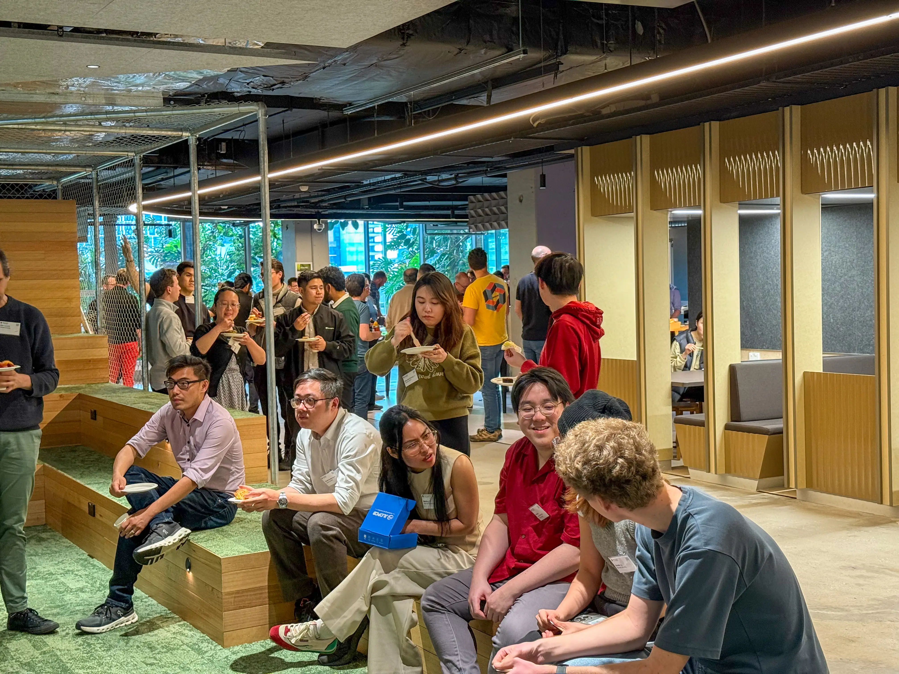

<!-- Truly not proud of this banner honestly. But eh c'est la vie -->

:::::: {.grid style="width: 100vw; transform: translateX(-20%); padding-bottom: 2rem;"}
::::: {.g-col-12 .title style="grid-template-columns: 1fr"}
:::: {style="display: flex; flex-direction: column; align-items:center; text-align: center"}
::: {style="font-weight: bold; font-size: 3.25rem"}
WOMBAT 2026
:::

**The Annual Workshop Organised by the Monash Business Analytics Team.**  
**November 2026**  
::::
:::::
::::::

```{=html}
<div class="img-grid">
  <div></div>
  <div></div>
  <div></div>

  <div></div> 
  <div></div>
  <div></div>

  <div></div>
  <div></div>
  <div></div>

</div>
```

The annual WOMBAT workshop brings together analysts from academia, industry and government to learn and discuss new open source tools for business analytics and data science. 
<!-- The theme of this year's event is **designing data driven discoveries**, which will feature tutorials and talks on statistical software, research collaboration, and impactful data analysis. -->
You should come if you are an analytics professional, or leading a team of analysts or a developer of new open source tools.

## Registration

**Registration for WOMBAT will open nearer to the event!**

Attendance will be limited to 20 participants (in-person and online) for each of the 8 tutorials on day 1, and 100 participants (in-person only) for day 2's workshop. We will also have a rich collection of hex stickers available for all to choose from to decorate your laptop!

#### Tutorials

The WOMBAT tutorials offerings feature practical, hands-on training in key topics for data analysis by experts in the field. Each tutorial consists of three hours of content with a 30-minute catered tea break, offered in both morning (AM) and afternoon (PM) sessions, and each tutorial is limited to 20 in-person participants.
<!-- In the morning, you can choose from sessions on R package development, regression analysis, time series forecasting, or visualising uncertainty; in the afternoon, there are options covering reproducible reporting with Quarto, scientific figure design, accelerating R modelling with C++, or efficiency analysis using Python. -->

#### Workshop

The main day of WOMBAT features a diverse workshop program designed to highlight the latest data analysis tools and techniques. The workshop features a keynote presentation<!-- by data visualisation specialist Nicola Rennie-->, followed by invited talks from leading data analysts from academia, government, and industry. <!--Key topics featured throughout the conference include data storytelling, effective data visualisation, workflow and team management, open-source tools, and reproducibility in data analysis.--> More details about the workshop will be shared nearer to the event.

<!-- We will also have a rich collection of hex stickers available on both days for all to choose from to decorate your laptop! -->


<!-- ## Keynote

::: {#keynote}
::: -->

<!-- ## Sessions

#### Invited Talks: Data Storytelling & Communication

This session highlights practical tools and skills for presenting data in compelling, audience-friendly ways. It features a presentation by James Goldie on making “scrollytelling” articles with Quarto and Closeread, this presentation format is highly engaging for data stories as visualisations can animate to match the story as readers scroll through the article.

#### In Conversation: Rob Hyndman & Nick Tierney on Research Software

Join Professor Rob Hyndman and Dr. Nick Tierney, hosted by Cynthia Huang, as they discuss what research software engineering, open-source development, and reproducibility mean in practice. The conversation will demystify how statistical software and R packages are created and maintained, and why open-source tools matter for advancing and sharing data analysis.

#### Showcase: Recent Software from NUMBATs

See the latest data analysis tools developed by staff and students at Monash University’s Non-Uniform Monash Business Analytics Team (NUMBATs). This session features new R packages designed to help you discover patterns in your data.

#### Invited Talks: Designing Workflows & Team

This session provides practical insights into effective team and workflow management in data projects. Saras Windecker will share lessons from implementing peer code review in a multi-institutional research consortium focused on epidemic forecasting and analytics. Tyler Reysenbach will discuss real-world strategies for building new data teams in government, including balancing early stakeholder demands with long-term capability building. -->

::: {#sponsors .g-col-12}
:::

```{=html}
<script>
  function updatePretalxScheduleFormat() {
    const schedule = document.querySelectorAll('pretalx-schedule');
    if (!schedule) return;
    if (document.body.offsetWidth > 1492) {
      schedule.forEach(x => x.setAttribute('format', 'grid'));
    } else {
      schedule.forEach(x => x.setAttribute('format', 'list'));
    }
  }

  // Run on load
  updatePretalxScheduleFormat();

  // Retrigger on window resize
  window.addEventListener('resize', updatePretalxScheduleFormat);
</script>
```
