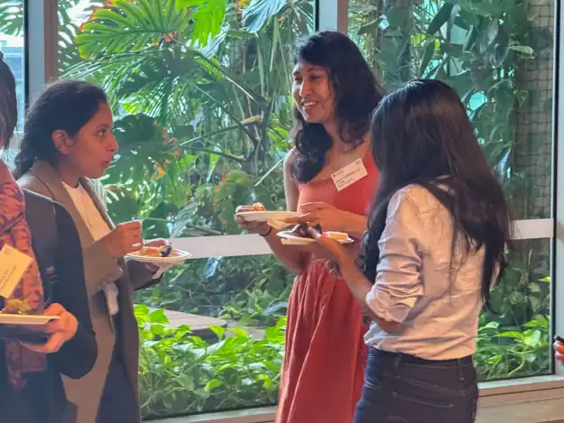
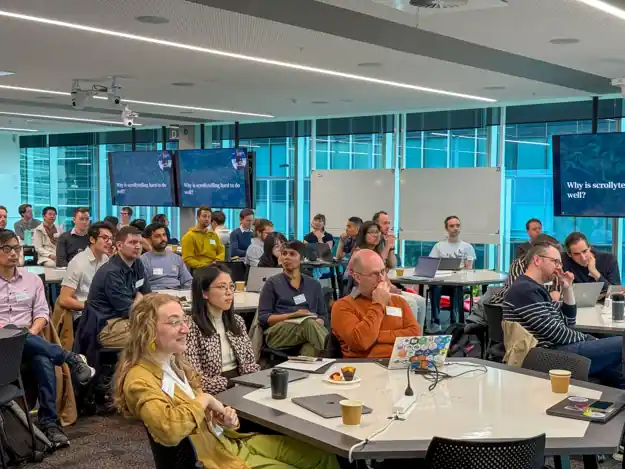
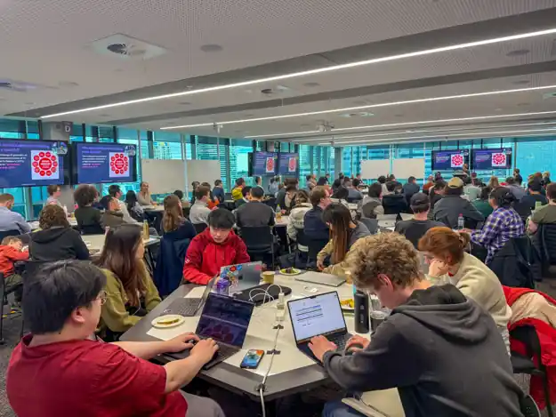
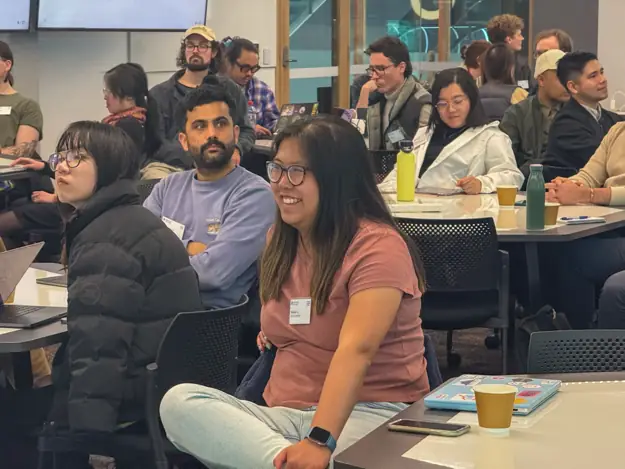
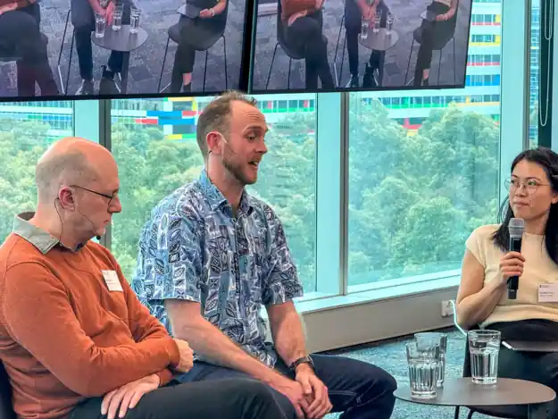
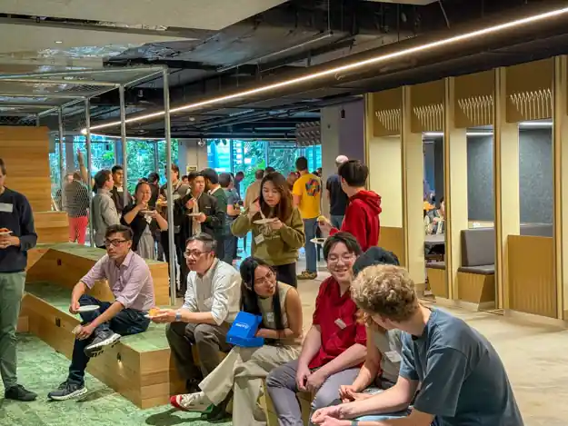
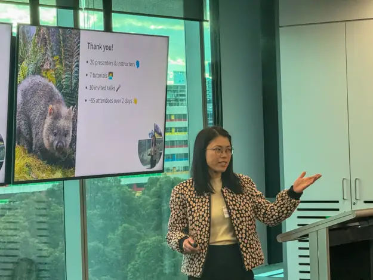

<!-- 
Design inspiration:
https://wif.nixtla.io/
https://conf.posit.co/2026/
-->


::: {.hero}

# WOMBAT

[**W**orkshop **O**rganised by the **M**onash **B**usiness **A**nalytics **T**eam]{.hero-tagline}

[30 Nov – 1 Dec 2026 · Melbourne, Australia]{.hero-call}

[*Learn and discuss open-source tools for business analytics and data science.*]{.hero-desc}

```{=html}
<div class="btn-group save-the-date-dropdown" role="group">
  <a href="participation/register.html" class="btn btn-primary btn-lg" style="color: white; margin-right: 0.5rem; border-radius: 0.5rem">
    Register
  </a>
  <button type="button" class="btn btn-primary btn-lg dropdown-toggle" data-bs-toggle="dropdown" aria-expanded="false" style="background: none; border-radius: 0.5rem">
    Add to calendar
  </button>
  <ul class="dropdown-menu">
    <li>
      <a class="dropdown-item" id="cal-google" href="#" target="_blank" rel="noopener">
        <svg xmlns="http://www.w3.org/2000/svg" width="16" height="16" viewBox="0 0 48 48" style="margin-right:.5em;vertical-align:-.2em"><path fill="#4285F4" d="M45.5 24.5c0-1.4-.1-2.7-.4-4H24v7.6h12.1c-.5 2.7-2.1 5-4.4 6.5v5.4h7.1c4.2-3.9 6.7-9.6 6.7-15.5z"/><path fill="#34A853" d="M24 46c6.1 0 11.2-2 14.8-5.5l-7.1-5.4c-2 1.3-4.5 2.1-7.7 2.1-5.9 0-10.9-4-12.7-9.3H4v5.6C7.6 41.3 15.3 46 24 46z"/><path fill="#FBBC04" d="M11.3 27.9c-.5-1.3-.7-2.6-.7-4s.3-2.7.7-4V14.3H4C2.4 17.4 1.5 20.6 1.5 24s.9 6.6 2.5 9.7l7.3-5.8z"/><path fill="#EA4335" d="M24 10.7c3.3 0 6.3 1.1 8.6 3.4l6.4-6.4C35.2 4 29.8 2 24 2 15.3 2 7.6 6.7 4 14.3l7.3 5.6C13.1 14.7 18.1 10.7 24 10.7z"/></svg>
        Google Calendar
      </a>
    </li>
    <li>
      <a class="dropdown-item" id="cal-outlook" href="#" target="_blank" rel="noopener">
        <svg xmlns="http://www.w3.org/2000/svg" width="16" height="16" viewBox="0 0 48 48" style="margin-right:.5em;vertical-align:-.2em"><rect width="26" height="26" x="20" y="20" fill="#0078d4" rx="2"/><rect width="26" height="26" x="2" y="2" fill="#28a8e0" rx="2"/><path fill="#fff" d="M12 10c-3.3 0-6 2.7-6 6s2.7 6 6 6 6-2.7 6-6-2.7-6-6-6zm0 9c-1.7 0-3-1.3-3-3s1.3-3 3-3 3 1.3 3 3-1.3 3-3 3z"/></svg>
        Outlook (web)
      </a>
    </li>
    <li><hr class="dropdown-divider"></li>
    <li>
      <a class="dropdown-item" id="cal-ical" href="#" download="WOMBAT-2026.ics">
        <svg xmlns="http://www.w3.org/2000/svg" width="16" height="16" fill="currentColor" viewBox="0 0 16 16" style="margin-right:.5em;vertical-align:-.2em"><path d="M3.5 0a.5.5 0 0 1 .5.5V1h8V.5a.5.5 0 0 1 1 0V1h1a2 2 0 0 1 2 2v11a2 2 0 0 1-2 2H2a2 2 0 0 1-2-2V3a2 2 0 0 1 2-2h1V.5a.5.5 0 0 1 .5-.5zM1 4v10a1 1 0 0 0 1 1h12a1 1 0 0 0 1-1V4H1z"/></svg>
        Apple Calendar (.ics)
      </a>
    </li>
    <li>
      <a class="dropdown-item" id="cal-ics" href="#" download="WOMBAT-2026.ics">
        <svg xmlns="http://www.w3.org/2000/svg" width="16" height="16" fill="currentColor" viewBox="0 0 16 16" style="margin-right:.5em;vertical-align:-.2em"><path d="M.5 9.9a.5.5 0 0 1 .5.5v2.5a1 1 0 0 0 1 1h12a1 1 0 0 0 1-1v-2.5a.5.5 0 0 1 1 0v2.5a2 2 0 0 1-2 2H2a2 2 0 0 1-2-2v-2.5a.5.5 0 0 1 .5-.5z"/><path d="M7.646 11.854a.5.5 0 0 0 .708 0l3-3a.5.5 0 0 0-.708-.708L8.5 10.293V1.5a.5.5 0 0 0-1 0v8.793L5.354 8.146a.5.5 0 1 0-.708.708l3 3z"/></svg>
        Download .ics
      </a>
    </li>
  </ul>
</div>

<!-- Data / Calendar Script Provided by User -->
<script>
(function () {
  var event = {
    title:       'WOMBAT 2026',
    description: 'Workshop Organised by the Monash Business Analytics Team. Learn and discuss open-source tools for business analytics and data science.',
    location:    'Melbourne, Australia',
    url:         'https://wombat.numbat.space',
    startDate:   '20261130',   // YYYYMMDD (all-day)
    endDate:     '20261202',   // iCal end is exclusive, so +1 day after last day
    startDateHuman: '2026-11-30',
    endDateHuman:   '2026-12-01'
  };

  var ics = [
    'BEGIN:VCALENDAR',
    'VERSION:2.0',
    'PRODID:-//WOMBAT 2026//EN',
    'CALSCALE:GREGORIAN',
    'METHOD:PUBLISH',
    'BEGIN:VEVENT',
    'UID:wombat-2026@numbat.space',
    'DTSTAMP:' + new Date().toISOString().replace(/[-:]/g, '').split('.')[0] + 'Z',
    'DTSTART;VALUE=DATE:' + event.startDate,
    'DTEND;VALUE=DATE:'   + event.endDate,
    'SUMMARY:'      + event.title,
    'DESCRIPTION:'  + event.description,
    'LOCATION:'     + event.location,
    'URL:'          + event.url,
    'END:VEVENT',
    'END:VCALENDAR'
  ].join('\r\n');

  var icsDataURI = 'data:text/calendar;charset=utf-8,' + encodeURIComponent(ics);

  var googleURL = 'https://calendar.google.com/calendar/render?action=TEMPLATE' +
    '&text='     + encodeURIComponent(event.title) +
    '&dates='    + event.startDate + '/' + event.endDate +
    '&details='  + encodeURIComponent(event.description) +
    '&location=' + encodeURIComponent(event.location) +
    '&sprop=website:' + encodeURIComponent(event.url);

  var outlookURL = 'https://outlook.live.com/calendar/0/deeplink/compose?path=/calendar/action/compose&rru=addevent' +
    '&subject='   + encodeURIComponent(event.title) +
    '&startdt='   + event.startDateHuman +
    '&enddt='     + event.endDateHuman +
    '&body='      + encodeURIComponent(event.description) +
    '&location='  + encodeURIComponent(event.location) +
    '&allday=true';

  document.getElementById('cal-google').href  = googleURL;
  document.getElementById('cal-outlook').href = outlookURL;
  document.getElementById('cal-ical').href    = icsDataURI;
})();
</script>
```
:::

# Keynote

```{=html}

  <div class="keynote-card" id="keynote-card">
    
    <!-- Left/Top Column: Speaker Profile -->
    <div class="profile-section">
      <div class="avatar-wrapper">
        
      </div>
      <div class="speaker-info">
        <h2 class="speaker-name" data-anchor-id="keynote">Rob J Hyndman</h2>
        <p class="speaker-role">
          <span class="highlight-title">Professor of Statistics</span><br>
          Department of Econometrics and Business Statistics<br>
          <span class="institution">Monash Business School</span>
        </p>
      </div>
    </div>

    <!-- Right/Bottom Column: Topic, Abstract & Bio -->
    <div class="content-section">
      <div class="topic-header">
        <h3 class="topic-title">Spotting the weird ones</h3>
      </div>
      
      <!-- Abstract: Visible by Default -->
      <div class="abstract-section">
        <p>Data analysis is about finding the stories hidden in the mass of information that make up a data set. Usually we are interested in understanding the major patterns and the relationships that hold true for most of the data. But sometimes we need to look at the weird observations, the mavericks, the ones that don’t follow the crowd and behave differently. These observations are called <strong>‘anomalies’</strong>.</p>
        <p>I will describe a principled statistical approach to identifying anomalies in diverse data sets, from simple numerical data to complex high-dimensional data objects. The ideas will be illustrated using the <code class="code-badge">{weird}</code> package for R applied to several data analysis problems, including spotting over-priced wines, identifying errors in the records of the Old Faithful Geyser, and uncovering forgotten epidemics in 19th century France.</p>
      </div>

      <!-- Toggle Trigger for Bio -->
      <button class="expand-toggle" aria-expanded="false" aria-controls="bio-details">
        <span class="toggle-text">Read Speaker Bio</span>
        <svg class="chevron-icon" viewBox="0 0 24 24" width="18" height="18" stroke="currentColor" stroke-width="2" fill="none"><path d="M6 9l6 6 6-6"/></svg>
      </button>

      <!-- Folded Content: Collapsible Bio -->
      <div class="folded-content" id="bio-details">
        <div class="inner-scroll">
          <div class="content-block">
            <h4>About Rob J Hyndman</h4>
            <p>Prof Hyndman holds the position of Vice-Chancellor’s Distinguished Professor of Statistics at Monash University, and is an internationally recognised expert in time series forecasting.</p>
            <p>He is a prolific writer, having authored more than 200 research papers and five books in statistical science, and has won awards for his research, teaching, consulting, and graduate supervision.</p>
            <p>His commitment to open research and teaching with open-source statistical software and online learning materials has had a major impact on the accessibility and practice of forecasting.</p>
          </div>
        </div>
      </div>
    </div>

</div>

<script>
  document.addEventListener("DOMContentLoaded", () => {
  const card = document.getElementById("keynote-card");
  const toggleBtn = card.querySelector(".expand-toggle");
  const foldedContent = card.querySelector(".folded-content");
  const toggleText = card.querySelector(".toggle-text");

  toggleBtn.addEventListener("click", () => {
    const isOpen = card.classList.toggle("is-expanded");
    foldedContent.classList.toggle("open");
    
    // Update accessibility attributes & text contextually
    toggleBtn.setAttribute("aria-expanded", isOpen);
    toggleText.textContent = isOpen ? "Hide Speaker Bio" : "Read Speaker Bio";
  });
});
</script>
```


# Program

::: {.program}

<!--  -->
```{=html}
<div class="banner">
  Program details will be announced soon!
</div>
```


:::

```{=html}
<section class="community-section">
    <h2>Community @ WOMBAT</h1>
    <p class="community-desc">
      At WOMBAT, Community is made up in the people you meet in between. Be it with food or coffee in hand, connecting with like minded people is always encouraged and made easy in WOMBAT 2026.
    </p>

    <!-- Gallery Sub-section -->
    <div class="gallery">
      
      
      
      
      
      
      
      
      
    </div>
  </section>

  <script>
    document.addEventListener("DOMContentLoaded", () => {
  const images = document.querySelectorAll(".gallery img");

  const observerOptions = {
    root: null, // uses the viewport
    rootMargin: "0px",
    threshold: 0.15 // Triggers when 15% of the image is visible
  };

  const observer = new IntersectionObserver((entries, observer) => {
    entries.forEach(entry => {
      if (entry.isIntersecting) {
        // Scrolled IN view
        entry.target.classList.add("is-visible");
      } else {
        // Scrolled OUT of view
        entry.target.classList.remove("is-visible");
      }
    });
  }, observerOptions);

  images.forEach(img => observer.observe(img));
});
    </script>
```

```{=html}
<section class="contact-section">
    <h2>Got a question?</h2>
    <p class="contact-desc">
      Reach out to us with any question you have!
    </p>
    <a href="mailto:buseco-ebs.wombat@monash.edu" class="btn-primary">Send a message</a>
  </section>
```


<!-- 


The annual WOMBAT workshop brings together analysts from academia, industry and government to learn and discuss open source tools for business analytics and data science.

You should come if you are an analytics professional, lead a team of analysts, or develop open source tools.

## Registration

Registration for WOMBAT will open nearer to the event.

Attendance will be limited to 20 participants (in-person and online) for each of the 8 tutorials on day 1, and 100 participants (in-person only) for day 2's workshop. We will also have a rich collection of hex stickers available for all to choose from to decorate your laptop.

### Tutorials

The WOMBAT tutorials offer practical, hands-on training in key topics for data analysis by experts in the field. Each tutorial includes three hours of content with a 30-minute catered tea break, offered in both morning (AM) and afternoon (PM) sessions.

### Workshop

The main day of WOMBAT features a diverse workshop program designed to highlight the latest data analysis tools and techniques. The workshop includes a keynote presentation, followed by invited talks from leading data analysts from academia, government, and industry. More details about the workshop will be shared nearer to the event.
 -->